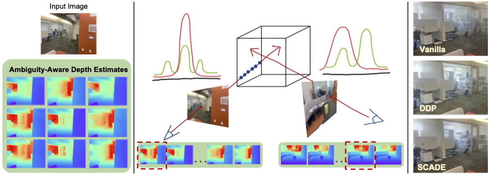
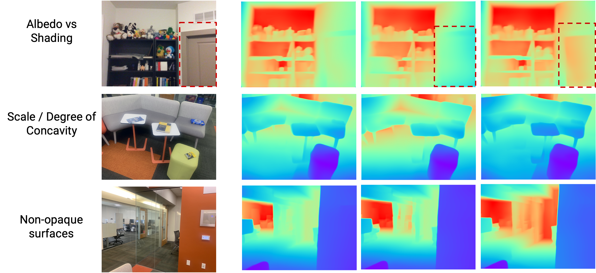

# SCADE: NeRFs from Space Carving with Ambiguity-Aware Depth Estimates 
**[SCADE: NeRFs from Space Carving with Ambiguity-Aware Depth Estimates](https://scade-spacecarving-nerfs.github.io)** 

Mikaela Angelina Uy, Ricardo Martin-Brualla, Leonidas Guibas and Ke Li

CVPR 2023




## Introduction
We present SCADE, a novel technique for NeRF reconstruction under **sparse, unconstrained views** for **in-the-wild indoor scenes**. We leverage on generalizable monocular depth priors and address to represent the inherent ambiguities of monocular depth by exploiting our **ambiguity-aware depth estimates** (leftmost). Our approach accounts for **multimodality** of both distributions using our novel **space carving loss** that seeks to **disambiguate** and find the common mode to fuse the information between different views (middle). As shown (rightmost), SCADE enables better photometric reconstruction especially in highly ambiguous scenes such as non-opaque surfaces.

```
@inproceedings{uy-scade-cvpr23,
      title = {SCADE: NeRFs from Space Carving with Ambiguity-Aware Depth Estimates},
      author = {Mikaela Angelina Uy and Ricardo Martin-Brualla and Leonidas Guibas and Ke Li},
      booktitle = {Conference on Computer Vision and Pattern Recognition (CVPR)},
      year = {2023}
  }
```

## SCADE Pretrained Models
SCADE pretrained models can be downloaded [here](http://download.cs.stanford.edu/orion/scade/pretrained_models.zip).
```
cd scade
wget http://download.cs.stanford.edu/orion/scade/pretrained_models.zip
unzip pretrained_models.zip
```

## Ambiguity-Aware Prior Pretrained Model
Our Ambiguity-aware prior pretrained model [here](http://download.cs.stanford.edu/orion/scade/ambiguity_aware_prior_pretrained_model.zip).
```
cd scade
wget http://download.cs.stanford.edu/orion/scade/ambiguity_aware_prior_pretrained_model.zip
unzip ambiguity_aware_prior_pretrained_model.zip
```

This model predicts a distribution of possible depth to capture the different ambiguities, such as albedo vs shading (top), different scales of concavity (middle) and multimodality in the outputs of non-opaque surfaces (bottom) as shown below.


## Datasets
Our processed datasets can be downloaded [here](http://download.cs.stanford.edu/orion/scade/datasets.zip).
```
cd scade
wget http://download.cs.stanford.edu/orion/scade/datasets.zip
unzip datasets.zip
```

## Code

### Environment Setup
This code was tested with Python 3.8 with CUDA 11.3 with A5000 and v100 GPUs.
```
conda env create -f env.yml
```
### Running SCADE Pretrained Models
On a Scannet scene:
```
### On test images
python run_scade_scannet.py test --data_dir datasets/scannet/ --scene_id scene0758_00 --cimle_dir dump_1102_scene0758_sfmaligned_indv --ckpt_dir pretrained_models/scannet --expname scene758_scade

### To output the video demo
python run_scade_scannet.py video --data_dir datasets/scannet/ --scene_id scene0758_00 --cimle_dir dump_1102_scene0758_sfmaligned_indv --ckpt_dir pretrained_models/scannet --expname scene758_scade
```

On In-the-Wild dataset:
```
python run_scade_wild.py test --data_dir datasets/in_the_wild/ --scene_id kitchen --cimle_dir kitchen_our_ambiguity_aware_prior_samples --ckpt_dir pretrained_models/in_the_wild --expname kitchen_scade
```

On Tanks and Temples dataset:
```
### On test images
python run_scade_wild.py test --data_dir datasets/tanks_and_temples/ --scene_id church --cimle_dir church_our_ambiguity_aware_prior_samples --ckpt_dir pretrained_models/tnt --expname church_scade

### To output the video demo
python run_scade_wild.py video --data_dir datasets/tanks_and_temples/ --scene_id church --cimle_dir church_our_ambiguity_aware_prior_samples --ckpt_dir pretrained_models/tnt --expname church_scade
```

### Running Ambiguity-Aware Prior Demo

TODO Documentation.

### Training SCADE
```
python run_scade_scannet.py train --data_dir datasets/scannet/ --scene_id scene0758_00 --cimle_dir dump_1102_scene0758_sfmaligned_indv --ckpt_dir logs_scannet --expname scene758
```

### Training our Ambiguity-Aware Prior
TODO Documentation.

## Miscellaneous
[DDP](https://github.com/barbararoessle/dense_depth_priors_nerf) depth completion prior trained on the Taskonomy dataset can be found [here](http://download.cs.stanford.edu/orion/scade/ddp_completion_taskonomy_prior.zip).
